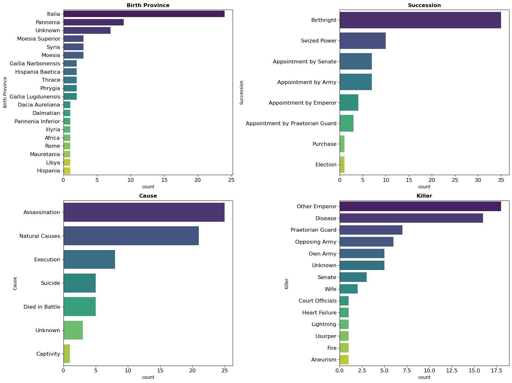
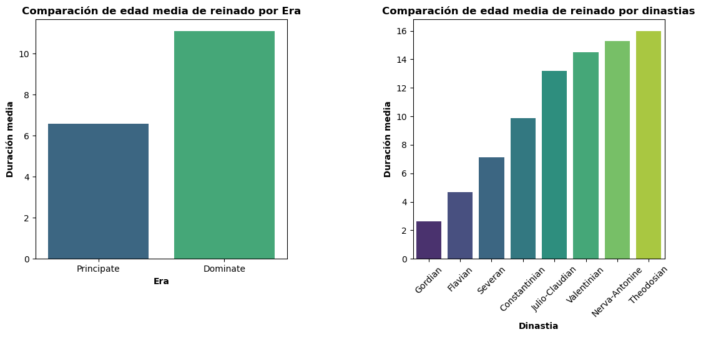
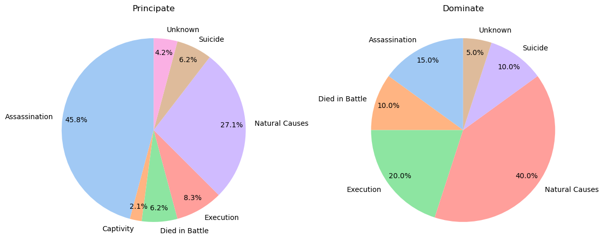
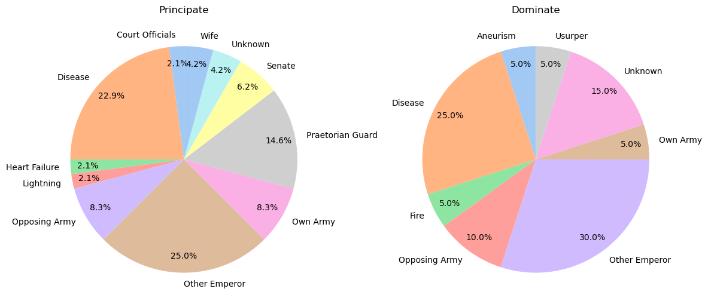

# Análisis de los Emperadores Romanos

En este proyecto, se han examinado datos históricos sobre los emperadores romanos, sus causas de muerte, duración de reinado y más. Cabe destacar que el período estudiado engloba desde el 26 AC hasta el 395 DC, que contiene las Eras Principado (27 AC - 284 DC) y Dominado (284-565 DC)

## Visualizaciones

Aquí presentamos algunas de las visualizaciones clave generadas durante el análisis:

### Duración Media de Reinado por Dinastía

En esta visualización, hemos analizado la duración media del reinado de los emperadores por dinastía. Se destaca la dinastía con la duración media más larga y la más corta.

### Causas de Muerte de los Emperadores

Esta gráfica muestra la duracion del reinado segun la era en la que se encontrabran y la dinastia a la que pertenecian.

### Causas de Muerte de los Emperadores por Eras

### Causante de Muerte de los Emperadores por Eras

## Resultados Destacados

Aquí presentamos algunos resultados destacados del análisis:

### Duración Media del Reinado

Durante el período analizado, la duración media del reinado de los emperadores romanos fue de aproximadamente **8 años**, que varía en funcion de la Era en la que nos encontremos. Para el Principado, la edad media era de aproximadamente **6 años**, mientras que para el Dominado subía casi al doble.

### Causa de Muerte más Común

La causa de muerte más común entre los emperadores romanos varía notablemente de nuevo con el cambio de Era, para el Principado, el **asesinato** representaba casi la mitad de las muertes de los emperadores, mientras que en el Dominado, la **enfermedad** era la principal causa de la muerte. Aun así, y para ambos períodos, los principales causantes de la muerte eran candidatos a emperador, o bien los ejercitos tanto propio como enemigo.

### Dinastía más Duradera

La dinastía de los Teodosianos se destacó con la duración media más larga del reinado, alcanzando un promedio de **16 años** en el poder. También fue la última dinastía en gobernar el imperio romano de Occidente. Un hecho que llama la atención es que cuanto más se acercaba el imperio occidental a su disolución, más duraban los emperadores en el poder. 

## Conclusiones

En este análisis, hemos explorado cómo murieron los emperadores romanos, las causas de muerte más comunes y la duración promedio de su reinado. Estos hallazgos ofrecen una visión fascinante de la historia del antiguo Imperio Romano y sus gobernantes.

---

_Si deseas ver el código utilizado para este análisis y las visualizaciones generadas, puedes revisar el archivo Emperadores romanos.ipynb de este repositorio._

